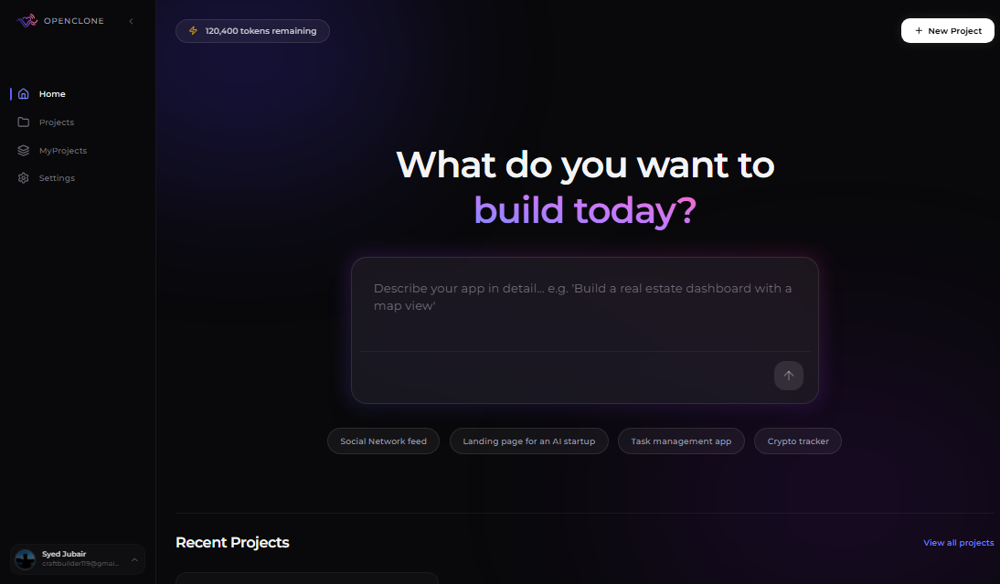

<div align="center">
  <br />
    <a href="https://youtu.be/gu4pafNCXng" target="_blank">
      
    </a>
  <br />

  <div>
    
    

<br/>

 


  </div>
  <br>
  <br>
  <br>
  <h1 align="center" padding="20px">OpenClone 2.0 — The AI Web Builder</h1>
  <p><em>Generate, edit, and preview full-stack web applications entirely in your browser—zero code required.</em></p>
</div> 


OpenClone is a powerful, full-stack AI-driven web builder designed to generate, edit, and preview web applications completely in the browser. Its a one in one tool for non technical users to create their own web applications without writing a single line of code. It uses the latest technologies and tools to provide a seamless experience for users.


<h1 align="center" padding="20px">The workspace</h1>


## 📖 The Story Behind v2

> **"What the hell is this code?!"** > — Me, logging back in after a 1-month exam break.

So I decided to change the code structure and make it more organized. OpenClone v2 introduces a clean architectural split, better state management, and an isolated browser execution environment. The new version is much better than the previous one and I'm very happy with it. I hope you will like it too. The original codebase was completely refactored from scratch to improve maintainability, scalability, and performance. 

## ✨ Key Features

* **🤖 AI Code Generation:** Powered by a robust tRPC-based AI router handler to stream or generate project code.
* **⚡ In-Browser Code Studio:** Full-featured code editor with a local directory tree context (`DirectoryContext`).
* **📦 WebContainer Sandbox:** Run actual Node.js environments securely inside the browser (`WebContainer.tsx`) to preview changes instantly.
* **💬 Real-Time Collaboration Chat:** Built-in project chat powered by Pusher for instantaneous, real-time message syncing.
* **⏳ Event-Driven Architecture:** Background jobs, webhooks, and long-running tasks handled smoothly via Inngest.
* **🔐 Modern Authentication:** Pre-configured route protection with structured auth layouts (`sign-in` / `sign-up`).

## 🛠️ Tech Stack Breakdown

| Layer | Technology | Purpose |
| :--- | :--- | :--- |
| **Core Framework** | **Next.js 14+** (App Router) | Server-side rendering, routing, and hybrid performance. |
| **Language** | **TypeScript** | Strict type safety across client and server boundaries. |
| **UI & Styling** | **Tailwind CSS + Shadcn UI** | Atomic, highly optimized components built on Radix UI primitives. |
| **API Layer** | **tRPC** (with TanStack Query) | End-to-end type-safe APIs without the boilerplate. |
| **Database & ORM** | **Prisma** | Declarative schema modeling and type-safe DB queries. |
| **Real-time Engine** | **Pusher** | WebSockets infrastructure for immediate chat updates. |
| **Background Queues**| **Inngest** | Serverless, step-by-step background job orchestration. |
| **Sandboxing** | **StackBlitz WebContainers** | Running an entire OS/Node environment in a browser tab. |

<br>
<br>

## 📐 Project Architecture

### High-Level Mindmap


### Directory Structure Overview
```text
.
├── proxy.ts                  # Reverse proxy config / dev optimization
│
├── app                       # Next.js App Router Core
│   ├── actions.ts            # Server Actions
│   ├── layout.tsx            # Global Root Layout
│   ├── (auth)                # Authentication routes (Sign-in/Sign-up)
│   ├── (project)             # Dynamic Project Workspace Router
│   ├── (root)                # User Dashboard & Main Landing Space
│   └── api                   # API Handlers (Auth, Inngest, tRPC)
│   
├── components                # Reusable UI Elements
│   ├── Shared                # Sidebar, Navigation, & Headers
│   └── ui                    # Highly optimized, atomic Shadcn Components
│
├── context                   # State Management Providers
│   ├── DirectoryContext.tsx  # Handles local workspace tree and files
│   └── ProjectContext.tsx    # Manages global project configurations
│
├── features                  # Core Business Logic Modules
│   ├── ProjectInput          # Initial prompt configurations
│   ├── Projects              # Dashboard feed views
│   └── ProjectView           # The main workspace wrapper
│       ├── Code Studio       # Holds the CodeEditor & WebContainer Preview
│       └── ProjectChat       # Real-time WebSockets communication window
│
├── hooks                     # Custom global React hooks
├── inngest                   # Background functions, events, and client setup
├── lib                       # Shared utilities, API clients, and constants
└── trpc                      # Type-safe API infrastructure and sub-routers
```

<br>

## 🚀 Getting Started

### Prerequisites

Ensure you have the following installed on your local machine:

* **Node.js** (v18.0.0 or higher)
* A package manager (**NPM**, **Yarn**, or **PNPM**)

### Installation Steps

#### 1. Clone the Repository & Install Dependencies

```bash
git clone [https://github.com/your-username/OpenClone.git](https://github.com/your-username/OpenClone.git)
cd OpenClone
npm install

```

#### 2. Set Up Environment Variables

Create a `.env` file in the root directory and populate it with your respective API credentials:

```env
DATABASE_URL="your_database_url"

NODE_ENV='development'

# Authentication (Better Auth)
BETTER_AUTH_SECRET="your_better_auth_secret"
BETTER_AUTH_URL="http://localhost:3000"

# AI Model Provider
GEMINI_API_KEY="your_gemini_api_key"

# Background Processing
INNGEST_DEV=1

# Real-Time Provider (Pusher)
PUSHER_APP_ID="your_pusher_app_id"
PUSHER_KEY="your_pusher_key"
PUSHER_SECRET="your_pusher_secret"
PUSHER_CLUSTER="ap2"
NEXT_PUBLIC_PUSHER_KEY="your_next_public_pusher_key"
NEXT_PUBLIC_PUSHER_CLUSTER="ap2"

# Media Storage
CLOUDINARY_CLOUD_NAME="your_cloudinary_name"
CLOUDINARY_API_KEY="your_cloudinary_key"
CLOUDINARY_API_SECRET="your_cloudinary_secret"

# OAuth Providers
GOOGLE_CLIENT_ID="your_google_id"
GOOGLE_CLIENT_SECRET="your_google_secret"
GITHUB_CLIENT_ID="your_github_id"
GITHUB_CLIENT_SECRET="your_github_secret"

```

#### 3. Initialize the Database

Run your Prisma migrations to set up the local or remote database schema:

```bash
npx prisma migrate dev

```

#### 4. Spin Up the Development Server

```bash
npm run dev

```

Now, open [http://localhost:3000](https://www.google.com/search?q=http://localhost:3000) in your browser to experience **OpenClone 2.0**!

---

## 🤝 Contributing & Extension

Because Version 2 is completely modularized, extending its capabilities is straightforward. If you want to dive in, here are the main entry points:

* **Modifying AI Generation Flows:** The core LLM prompting strategies, token streaming, and system routers live in:
`trpc/routers/Ai.ts`
* **Tweaking File Explorer Contexts:** The virtual file system state management layer that talks directly to the WebContainer engine lives in:
`context/DirectoryContextProvider.tsx`

Feel free to open an issue or submit a pull request. Let's build the future of zero-code web generation together! 🚀
